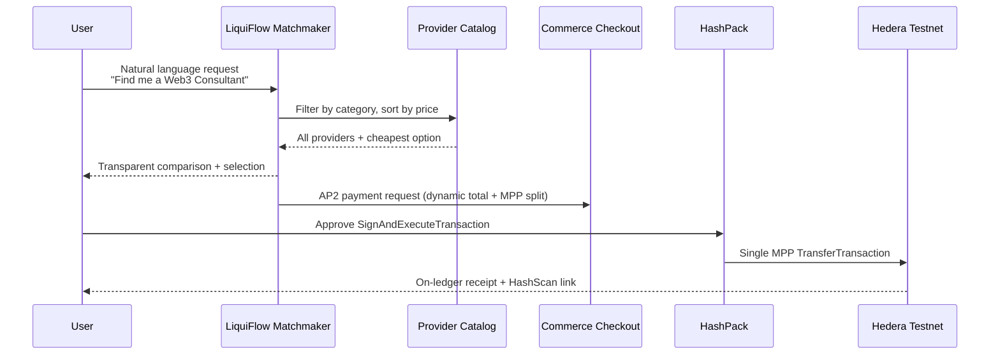

# LiquiFlow AI

**Decentralized Intellectual Services Marketplace — Hedera Hackathon (Week 4 Bounty)**

LiquiFlow AI is an agentic commerce platform that demonstrates the future of Web3 marketplaces: an AI matchmaker that understands natural-language service requests, transparently compares decentralized providers, selects the most affordable expert, and settles payment through a single on-ledger **Multi-Party Payment (MPP)** on Hedera Testnet.

Rather than routing users through static listings and manual checkout, LiquiFlow positions the AI as an intelligent intermediary—scanning providers, surfacing price transparency, generating a dynamic **Agentic Payment Protocol (AP2)** execution gateway, and orchestrating atomic settlement between the expert and the platform in one transaction.

---

## The Vision: Agentic Commerce

Commerce is shifting from human-driven search-and-pay to **agent-driven matchmaking-and-settlement**. LiquiFlow models this transition for intellectual and professional services—Web3 consulting, smart contract audits, legal advisory, psychological support, and more.

The platform proves three capabilities judges care about:

1. **Intelligence** — The agent extracts intent, queries a provider catalog, and optimizes for cost.
2. **Transparency** — Every alternative in a category is listed before the cheapest option is selected.
3. **Settlement** — Payment is not a UI mock; it is a real Hedera `TransferTransaction` signed via HashPack and split across multiple recipients atomically.

This MVP is designed to scale into a global, automated services marketplace where agents negotiate, route, and settle on behalf of users at machine speed.

---

## Hackathon Week 4 Bounty Alignment

### AP2 — Agentic Payment Protocol

LiquiFlow implements AP2 as a **dynamic execution gate** between AI reasoning and on-chain settlement.

| AP2 Capability | LiquiFlow Implementation |
|---|---|
| Standardized payment payload | `AP2PaymentRequest` in `src/lib/ap2.ts` with `type: "ap2_payment_request"` |
| Agent-as-router | AI scans `mockServicesDb`, ranks by price, selects cheapest provider |
| Dynamic gateway generation | `createMarketplacePaymentRequest()` builds fee + split per matched service |
| Human-in-the-loop execution | Commerce Panel renders checkout; user approves in HashPack |
| Auditability | Raw AP2 JSON available in `PaymentCard`; memo + HashScan explorer links |

**Flow:** User request → category intent extraction → provider scan → cheapest match → AP2 payload with `amount_hbar`, `reason`, and `split_recipients` → Agentic Commerce Checkout panel.

The AI does not merely *describe* a payment—it **constructs** the canonical AP2 object that downstream wallet and ledger code consumes.

### MPP — Multi-Party Payment (True On-Ledger Split)

LiquiFlow executes a **single atomic Hedera `TransferTransaction`** that debits the payer and credits multiple recipients in one consensus operation—no chained transfers, no escrow simulation.

```
Payer (HashPack)  ──►  -TOTAL HBAR
                         ├──► Expert / Merchant (0.0.11111)  : service price (dynamic)
                         └──► Platform Agent   (0.0.22222)  : 0.05 HBAR matchmaking fee
```

| MPP Detail | Implementation |
|---|---|
| Transaction builder | `buildMPPTransferTransaction()` in `src/lib/mpp.ts` |
| Wallet execution | HashPack via `@hashgraph/hedera-wallet-connect` (`Signer.call` → SignAndExecuteTransaction) |
| Server execution | `executeAP2Payment()` in `src/lib/hederaService.ts` (operator-signed path) |
| Testnet node | Explicit `0.0.3` on `testnet.hedera.com` |
| Post-payment proof | HashScan links via formatted transaction ID |

**Example:** Web3 consulting match with DecentralizeMe at **0.12 HBAR** + **0.05 HBAR** platform fee → **0.17 HBAR** total, settled in one MPP transfer with visible breakdown in chat and checkout.

---

## How It Works



### User Journey

1. **Request** — User describes the expert or service they need in chat.
2. **Matchmaking** — AI extracts category intent, lists all providers with prices, and auto-selects the cheapest.
3. **AP2 Gate** — Agentic Commerce Checkout opens with dynamic totals (service fee + 0.05 HBAR network fee).
4. **Wallet Sign** — User connects HashPack and approves the MPP transfer.
5. **Settlement** — One Hedera transaction splits payment between expert settlement and platform matchmaking fee.
6. **Verification** — Success state shows MPP breakdown and a HashScan explorer link.

---

## Tech Stack

| Layer | Technology |
|---|---|
| Frontend | [Next.js 16](https://nextjs.org/) (App Router), React 19, TypeScript |
| Styling | [Tailwind CSS 4](https://tailwindcss.com/) |
| Ledger | [Hedera Hashgraph SDK](https://github.com/hiero-ledger/hiero-sdk-js) (`@hashgraph/sdk`, `@hiero-ledger/sdk`) |
| Wallet | [HashPack](https://hashpack.app/) via `@hashgraph/hedera-wallet-connect` (WalletConnect) |
| Agent (extended) | Vercel AI SDK + OpenAI (`/api/chat` route for tool-based agent loop) |
| Network | Hedera Testnet (`testnet.hedera.com`, mirror node, HashScan) |

---

## Project Structure

```
src/
├── app/                    # Next.js App Router (page, layout, API routes)
├── components/
│   ├── ChatWindow.tsx      # AI matchmaker chat + quick prompts
│   ├── CommercePanel.tsx   # Agentic commerce checkout + MPP success view
│   └── WalletButton.tsx    # HashPack connection
├── lib/
│   ├── ap2.ts              # AP2 payment request schema + marketplace builder
│   ├── mpp.ts              # MPP TransferTransaction builder
│   ├── mockServicesDb.ts   # Provider catalog + matchmaking logic
│   ├── hederaService.ts    # Server-side Hedera client + operator payments
│   └── hashscan.ts         # Explorer URL formatting + consensus timestamp resolution
└── providers/
    ├── LiquiFlowProvider.tsx   # Chat + commerce state orchestration
    └── WalletProvider.tsx        # HashPack / WalletConnect integration
```

---

## Future Potential & Scalability

LiquiFlow is architected as a **marketplace primitive**, not a demo page.

| Phase | Direction |
|---|---|
| **Near-term** | Replace `mockServicesDb` with on-chain provider registries, IPFS profiles, or HCS-indexed listings |
| **Mid-term** | Multi-agent negotiation (price, availability, reputation), composable AP2 gates per service type |
| **Long-term** | Global intellectual-services marketplace—agents match, book, and settle across jurisdictions with Hedera's low fees and finality |

Key scalability enablers already in place:

- **Dynamic AP2 payloads** — any service price maps to a valid payment request without code changes
- **Atomic MPP** — platform and provider paid in one transaction; no payment fragmentation
- **Wallet-agnostic signing** — WalletConnect standard supports HashPack and compatible Hedera wallets
- **Transparent agent behavior** — full provider comparison before selection builds user trust at scale

---

## Local Setup

### Prerequisites

- Node.js 20+
- npm
- [HashPack](https://hashpack.app/) browser extension (Testnet account with HBAR)
- [WalletConnect Project ID](https://cloud.reown.com/) (formerly Reown Cloud)

### 1. Clone & install

```bash
git clone https://github.com/hedera2hashgraphagent/liquiflow-ai.git
cd liquiflow-ai
npm install
```

### 2. Environment variables

Create `.env.local` in the project root:

```env
# Required — HashPack / WalletConnect (client-side)
NEXT_PUBLIC_WALLETCONNECT_PROJECT_ID=your_walletconnect_project_id

# Optional — Server-side operator payments (/api/ap2/payment)
HEDERA_OPERATOR_ID=0.0.xxxxx
HEDERA_OPERATOR_PRIVATE_KEY=your_der_encoded_private_key

# Optional — AI SDK chat agent route (/api/chat)
OPENAI_API_KEY=your_openai_api_key
```

> **Note:** The primary marketplace demo flow uses **HashPack client-side signing**. WalletConnect credentials are required. Operator keys are only needed for the server-side payment API route.

### 3. Run the development server

```bash
npm run dev
```

Open [http://localhost:3000](http://localhost:3000).

### 4. Try the demo

1. Connect **HashPack** (Testnet) via the header wallet button.
2. In chat, try a quick prompt:
   - *"Find me a Web3 Consultant"*
   - *"I need a Smart Contract Audit"*
   - *"Search for Psychological Support"*
3. Review the AI's **full provider comparison** and cheapest selection.
4. Complete payment in the **Service Booking** panel.
5. Confirm the MPP transfer in HashPack.
6. Open the **HashScan** link to verify the on-ledger split.

### Build for production

```bash
npm run build
npm start
```

---

## Service Categories (MVP Catalog)

| Category | Example Providers | Price Range (HBAR) |
|---|---|---|
| Web3 Consulting | DecentralizeMe, Dr. Aram, Elite Blockchain | 0.12 – 0.50 |
| Smart Contract Audit | SafeLedger Labs, SecureCode, AuditChain Pro | 0.35 – 0.55 |
| Psychological Support | MindCare Online, Wellness DAO | 0.10 – 0.14 |
| Legal Advisory | Token Counsel, ChainLaw Partners | 0.18 – 0.22 |

Platform matchmaking fee: **0.05 HBAR** per booking (MPP recipient: `0.0.22222`).

---

## License

Apache-2.0 — see Hedera SDK and wallet-connect package licenses for dependency terms.

---

## Team & Submission

**LiquiFlow AI** — Hedera Hackathon Week 4 Bounty Submission

Built to prove that **Agentic Commerce** on Hedera is not theoretical: AI can match, AP2 can gate, and MPP can settle—all in one cohesive product experience.
