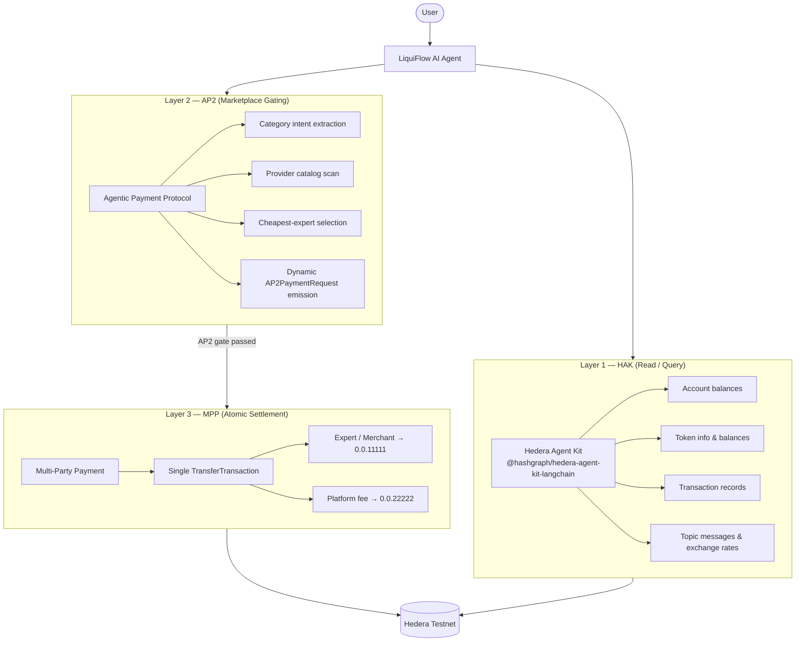
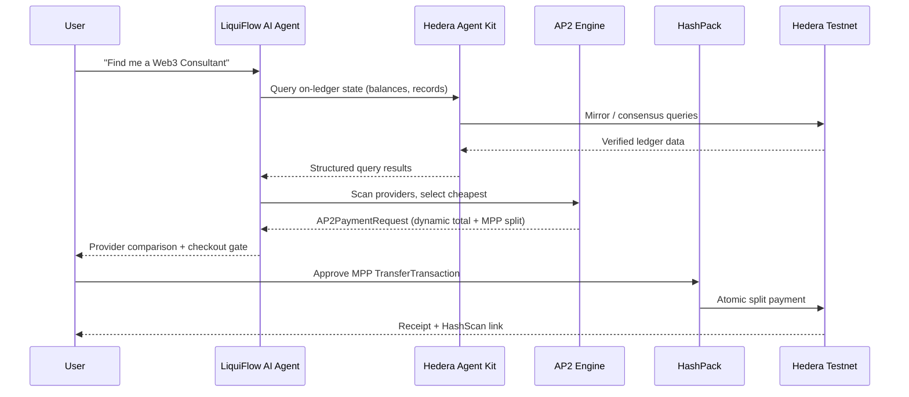

# LiquiFlow AI

**Decentralized Services Marketplace — Hedera Hackathon (Week 4 Bounty)**

LiquiFlow AI is an agentic commerce platform built on Hedera Testnet. A single AI agent orchestrates decentralized expert matchmaking, on-ledger data retrieval, payment gating, and atomic settlement—demonstrating the production architecture for **Agentic Commerce** on Hashgraph.

The system deliberately separates concerns across three protocol layers:

| Layer | Protocol | Responsibility |
|---|---|---|
| **Layer 1** | **Hedera Agent Kit (HAK)** | Native blockchain read/query operations |
| **Layer 2** | **AP2** (Agentic Payment Protocol) | Marketplace logic, expert matchmaking, access gating |
| **Layer 3** | **MPP** (Multi-Party Payment) | Atomic split settlement on-ledger |

LiquiFlow does not conflate these layers. HAK handles what Hedera does best—consensus-verified reads. AP2 handles what agents do best—intent routing and commerce gating. MPP handles what the ledger guarantees—atomic, multi-recipient transfers in a single transaction.

---

## The Problem

Traditional service marketplaces force users through static listings, opaque pricing, and fragmented payments. LiquiFlow inverts this model: the agent accepts natural-language intent, queries real on-chain state via HAK, transparently compares decentralized providers, gates premium actions behind AP2, and settles merchant + platform fees in one MPP transfer.

---

## Three-Layer Security Model



### Layer 1 — Hedera Agent Kit (HAK)

All native blockchain **read and query** operations route through the official [Hedera Agent Kit](https://docs.hedera.com/solutions/ai/agent-kit). LiquiFlow integrates `@hashgraph/hedera-agent-kit` and `@hashgraph/hedera-agent-kit-langchain` in the chat API agent loop.

| HAK Integration | Implementation |
|---|---|
| Toolkit | `HederaLangchainToolkit` initialized with operator client |
| Plugins | `allCorePlugins` from `@hashgraph/hedera-agent-kit/plugins` |
| Execution mode | `AgentMode.AUTONOMOUS` (operator-signed queries) |
| Bridge | `src/lib/hederaAgentKit.ts` adapts `getTools()` → Vercel AI SDK `dynamicTool` |
| Agent route | `src/app/api/chat/route.ts` merges HAK tools with LiquiFlow AP2 tools |

HAK tools power verifiable on-ledger lookups—account balances, token metadata, transaction records, topic messages—without custom mirror-node plumbing. The agent reasons over **real Hedera state**, not mocked responses.

**Boundary rule:** HAK is scoped to native Hedera operations. Marketplace fee collection and service booking settlement are explicitly delegated to AP2/MPP, never to HAK transfer tools.

### Layer 2 — AP2 (Agentic Payment Protocol)

AP2 is LiquiFlow's custom commerce gating protocol. Before any paid marketplace action executes, the agent emits a canonical `AP2PaymentRequest` that the UI intercepts and renders as a checkout gate.

| AP2 Capability | Implementation |
|---|---|
| Standardized payload | `AP2PaymentRequest` in `src/lib/ap2.ts` — `type: "ap2_payment_request"` |
| Agent-as-router | Scans `mockServicesDb`, ranks providers by price, selects cheapest |
| Dynamic pricing | `createMarketplacePaymentRequest()` — service fee + 0.05 HBAR platform fee |
| Human-in-the-loop | Commerce Panel renders checkout; user approves via HashPack |
| Auditability | Raw AP2 JSON in PaymentCard; HashScan links post-settlement |

**Flow:** Natural-language request → category intent → full provider comparison → cheapest selection → `AP2PaymentRequest` with `amount_hbar`, `reason`, `split_recipients` → Agentic Commerce Checkout.

The agent does not describe a payment—it **constructs** the AP2 object that wallet and ledger code consume.

### Layer 3 — MPP (Multi-Party Payment)

MPP executes a **single atomic `TransferTransaction`** debiting the payer and crediting multiple recipients in one consensus round. No chained transfers. No escrow simulation.

```
Payer (HashPack)  ──►  -TOTAL HBAR
                         ├──► Expert / Merchant (0.0.11111)  : dynamic service price
                         └──► Platform Agent   (0.0.22222)  : 0.05 HBAR matchmaking fee
```

| MPP Detail | Implementation |
|---|---|
| Transaction builder | `buildMPPTransferTransaction()` in `src/lib/mpp.ts` |
| Client signing | HashPack via `@hashgraph/hedera-wallet-connect` (`Signer.call`) |
| Server signing | `executeAP2Payment()` in `src/lib/hederaService.ts` |
| Consensus node | Explicit `0.0.3` on `testnet.hedera.com:50211` |
| Verification | HashScan explorer via formatted transaction ID |

**Example:** Web3 consulting — DecentralizeMe @ **0.12 HBAR** + platform fee **0.05 HBAR** = **0.17 HBAR** total, one MPP transfer, full breakdown in UI.

---

## Agent Architecture



### Dual Tool Surface

The `/api/chat` agent exposes two complementary tool sets:

| Tool Set | Source | Purpose |
|---|---|---|
| **HAK tools** | `hederaToolkit.getTools()` | On-ledger reads, queries, native Hedera operations |
| **LiquiFlow tools** | `src/lib/tools.ts` | AP2 gating (`requestAP2Payment`), marketplace matchmaking, MPP receipt validation (`executeSwap`) |

System prompt guardrails enforce separation: AP2 marketplace fees always flow through `requestAP2Payment`; users settle via HashPack MPP in the UI.

---

## Tech Stack

| Component | Technology |
|---|---|
| Framework | [Next.js 16](https://nextjs.org/) (App Router), React 19, TypeScript |
| Styling | [Tailwind CSS 4](https://tailwindcss.com/) |
| AI Orchestration | [Vercel AI SDK](https://sdk.vercel.ai/) + OpenAI (`streamText` agent loop) |
| Hedera Agent Kit | `@hashgraph/hedera-agent-kit` + `@hashgraph/hedera-agent-kit-langchain` |
| Ledger SDK | `@hashgraph/sdk`, `@hiero-ledger/sdk` |
| Wallet | [HashPack](https://hashpack.app/) via `@hashgraph/hedera-wallet-connect` |
| Network | Hedera Testnet — node `0.0.3`, mirror node, [HashScan](https://hashscan.io/testnet) |

---

## Project Structure

```
src/
├── app/
│   └── api/
│       ├── chat/route.ts       # AI agent — HAK + AP2/MPP tool orchestration
│       └── ap2/payment/route.ts # Server-side MPP execution (operator path)
├── components/
│   ├── ChatWindow.tsx          # Matchmaker chat + quick prompts
│   ├── CommercePanel.tsx       # AP2 checkout + MPP success view
│   └── PaymentCard.tsx         # AP2 payment request renderer
├── lib/
│   ├── hederaAgentKit.ts       # HAK toolkit init + Vercel AI SDK bridge
│   ├── ap2.ts                  # AP2 schema + marketplace payment builder
│   ├── mpp.ts                  # MPP TransferTransaction builder
│   ├── mockServicesDb.ts       # Provider catalog + matchmaking logic
│   ├── hederaService.ts        # Operator client + server-side payments
│   ├── tools.ts                # LiquiFlow AP2/MPP agent tools
│   └── hashscan.ts             # Explorer URL + consensus timestamp resolution
└── providers/
    ├── LiquiFlowProvider.tsx   # Chat + commerce state
    └── WalletProvider.tsx      # HashPack / WalletConnect integration
```

---

## Local Setup

### Prerequisites

- Node.js 20+
- npm
- [HashPack](https://hashpack.app/) browser extension (Testnet account with HBAR)
- [WalletConnect Project ID](https://cloud.reown.com/)
- Hedera Testnet operator account ([portal.hedera.com](https://portal.hedera.com/dashboard))
- OpenAI API key

### 1. Clone & install

```bash
git clone https://github.com/hedera2hashgraphagent/liquiflow-ai.git
cd liquiflow-ai
npm install
```

### 2. Environment variables

Create `.env.local` in the project root:

```env
# Required — Hedera Agent Kit operator (server-side HAK + ledger queries)
HEDERA_OPERATOR_ID=0.0.xxxxx
HEDERA_OPERATOR_PRIVATE_KEY=your_der_or_hex_encoded_private_key

# Required — AI agent orchestration
OPENAI_API_KEY=sk-proj-...

# Required — HashPack / WalletConnect (client-side MPP signing)
NEXT_PUBLIC_WALLETCONNECT_PROJECT_ID=your_walletconnect_project_id
```

| Variable | Required | Purpose |
|---|---|---|
| `HEDERA_OPERATOR_ID` | **Yes** | Operator account for HAK toolkit initialization |
| `HEDERA_OPERATOR_PRIVATE_KEY` | **Yes** | Private key for HAK autonomous query execution |
| `OPENAI_API_KEY` | **Yes** | Powers the `/api/chat` agent loop |
| `NEXT_PUBLIC_WALLETCONNECT_PROJECT_ID` | **Yes** | HashPack wallet connection for MPP payments |

> HAK requires a configured operator client. Without `HEDERA_OPERATOR_ID` and `HEDERA_OPERATOR_PRIVATE_KEY`, the agent falls back to AP2/MPP tools only—native on-ledger queries will be unavailable.

### 3. Run

```bash
npm run dev
```

Open [http://localhost:3000](http://localhost:3000).

### 4. Demo walkthrough

1. Connect **HashPack** (Testnet) via the header wallet button.
2. In chat, request a service:
   - *"Find me a Web3 Consultant"*
   - *"I need a Smart Contract Audit"*
   - *"What's my HBAR balance?"* (exercises HAK query tools)
3. Review the agent's **full provider comparison** and cheapest selection.
4. Complete payment in the **Service Booking** panel (AP2 gate).
5. Approve the **MPP transfer** in HashPack.
6. Verify the on-ledger split via the **HashScan** link.

### Production build

```bash
npm run build
npm start
```

---

## Service Categories (MVP Catalog)

| Category | Example Providers | Price Range (HBAR) |
|---|---|---|
| Web3 Consulting | DecentralizeMe, Dr. Aram, Elite Blockchain | 0.12 – 0.50 |
| Smart Contract Audit | SafeLedger Labs, SecureCode, AuditChain Pro | 0.35 – 0.55 |
| Psychological Support | MindCare Online, Wellness DAO | 0.10 – 0.14 |
| Legal Advisory | Token Counsel, ChainLaw Partners | 0.18 – 0.22 |

Platform matchmaking fee: **0.05 HBAR** per booking (MPP recipient `0.0.22222`).

---

## Hackathon Week 4 Bounty — Technical Summary

| Bounty Requirement | LiquiFlow Implementation |
|---|---|
| **Hedera Agent Kit** | `HederaLangchainToolkit` with `allCorePlugins`, bridged into Vercel AI SDK agent |
| **AP2 — Agentic Payment Protocol** | Custom `AP2PaymentRequest` schema; dynamic gateway per matched service |
| **MPP — Multi-Party Payment** | Single `TransferTransaction` splitting expert settlement + platform fee atomically |
| **Agentic Commerce** | End-to-end: NL intent → HAK queries → AP2 matchmaking → MPP settlement |

---

## Scalability

LiquiFlow is architected as a **marketplace primitive**, not a static demo.

| Phase | Direction |
|---|---|
| **Near-term** | Replace `mockServicesDb` with HCS-indexed provider registries or on-chain listings |
| **Mid-term** | Composable AP2 gates per service type; multi-agent price negotiation |
| **Long-term** | Global intellectual-services marketplace with HAK-powered reputation and MPP-native revenue splits |

Enablers already in production:

- **HAK plugin surface** — any new Hedera capability ships as a toolkit plugin, not custom integration code
- **Dynamic AP2 payloads** — arbitrary service prices map to valid payment requests without code changes
- **Atomic MPP** — merchant and platform paid in one transaction; zero payment fragmentation
- **Wallet-agnostic signing** — WalletConnect supports HashPack and compatible Hedera wallets

---

## License

Apache-2.0 — see Hedera SDK, Agent Kit, and wallet-connect package licenses for dependency terms.

---

## Submission

**LiquiFlow AI** — Hedera Hackathon Week 4 Bounty

A three-layer agentic commerce stack on Hedera: **HAK** for verified on-ledger reads, **AP2** for intelligent marketplace gating, **MPP** for atomic split settlement. Built to demonstrate that Agentic Commerce on Hashgraph is production-ready architecture—not a concept demo.
